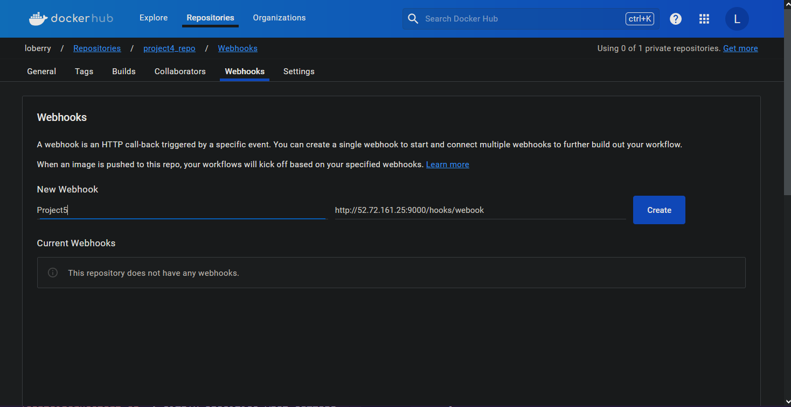
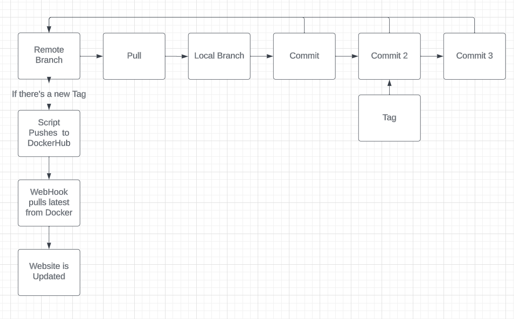

## Project 5 - CD
Name: Logan Scarberry
### Part 1 - Semantic Versioning 
- CD Project Overview
    - The purpose of this project is to continue what I've learned in Project 4 about `docker`, `webhook`, `apache2`, and `git`. The goal is to create an `EC2` instance with `AWS` that will serve as a server for `webhook`. Then, that server will act as a listener and be used to update my website. This means I'll be able to update my website from my own local machine by simply pushing to a repository and then having my server listen to that repository for updates.
- How to Generate a `tag` in `git`/ GitHub
    - `git commit -am "Your comment"`
    - `git tag -a v1.0.0` > Type in your comment otherwise use `-m` to comment
    - `git show v1.0.0` to display everything included in the version (`q` to quit). <br>
     <br>
- Behavior of GitHub workflow
    - `git push origin v1.0.0` To push the tagged commit. <br>
    
    - Navigate back to the repository on GitHub to see that the tag was pushed. <br>
     <br>
    
- Link to [DockerHub repository](https://hub.docker.com/repository/docker/loberry/project4_repo/tags?page=1&ordering=last_updated)

### Part 2 - Development
- How to install Docker on instance:
    - `sudo apt-get update` <br>
    
    - `sudo vim /etc/apt/apt.conf.d/20auto-upgrades`
    - Set `APT::Periodic::Unattended-Upgrade` to `0` <br>
    
    - `sudo apt-get install ca-certificates curl gnupg`
    - `sudo install -m 0755 -d /etc/apt/keyrings`
    - `curl -fsSL https://download.docker.com/linux/ubuntu/gpg | sudo gpg --dearmor -o /etc/apt/keyrings/docker.gpg`
    - `sudo chmod a+r /etc/apt/keyrings/docker.gpg`
    - Next, run:
    ```
    echo \
        "deb [arch=$(dpkg --print-architecture) signed-by=/etc/apt/keyrings/docker.gpg] https://download.docker.com/linux/ubuntu \
        $(. /etc/os-release && echo "$VERSION_CODENAME") stable" | \
    sudo tee /etc/apt/sources.list.d/docker.list > /dev/null
    ```
    - `sudo apt-get update`
    - `sudo apt-get install docker-ce docker-ce-cli containerd.io docker-buildx-plugin docker-compose-plugin`
    - `sudo docker run hello-world` To verify docker installed successfully. <br>
    
    - `sudo docker pull loberry/project4_repo:latest` To verify a successful `pull`
    - `sudo docker run -i -t 7d174f9f23d6 /bin/bash` To `run` <br>
    
- Container Restart Script
    - Script:
    ```
    #!/bin/bash

    sudo docker pull loberry/project4_repo:latest

    sudo docker restart $(sudo docker ps -q)
    ```
    - The script is called `containerRestart.sh` and it's currently located in the home directory. While not the most secure location, it's currently placed there as a way for me to easily run it when using `ssh` into the server.
    - The script does 2 things:
        - `sudo docker pull loberry/project4_repo:latest`: This command pulls the latest docker image from my docker.
        - `sudo docker restart $(sudo docker ps -q)`: This command reads the name of all the container ids from a `docker ps` command and then uses them as a variable for the `docker restart` command. Meaning it will restart all my containers by the id pulled from `docker ps`.
- Installing `webhook`:
    - `sudo apt-get install webhook`
- `webhook` definition file:
    - `hook.json`:
    ```
    [
        {
            "id": "restart-containers",
            "execute-command": "/home/ubuntu/containerRestart.sh",
            "command-working-directory": "/var/webhook"
        }
    ]
    ```
    - There are 3 main lines of code inside the file.
        - `"id": "restart-containers"`: declares an ID for the hook and is used in creating the HTTP endpoint.
        - `"execute-command": "./containerRestart.sh"`: simply specifies what command to be run when the hook is executed. In my case, it's running my `containerRestart.sh` that restarts my containers.
        - `"command-working-directory": "/var/webhook"`: specifies the working directory for the script once executed.
    - This should be located in the `home` directory on the server. In a better scenario, it should be saved inside the `/etc` folder so that you can save it alongside other `webhook.conf` files.
        - `sudo cp hook.json /etc/webhook.conf`
- How to configure `DockerHub` to message the listener
    - Navigate to the dockerhub repository and select `Webhooks`
    - Paste the webhook url and give it a name: `http://52.72.161.25:9000/hooks/webook` and click `Create` <br>
    
### Part 3 - Diagramming
