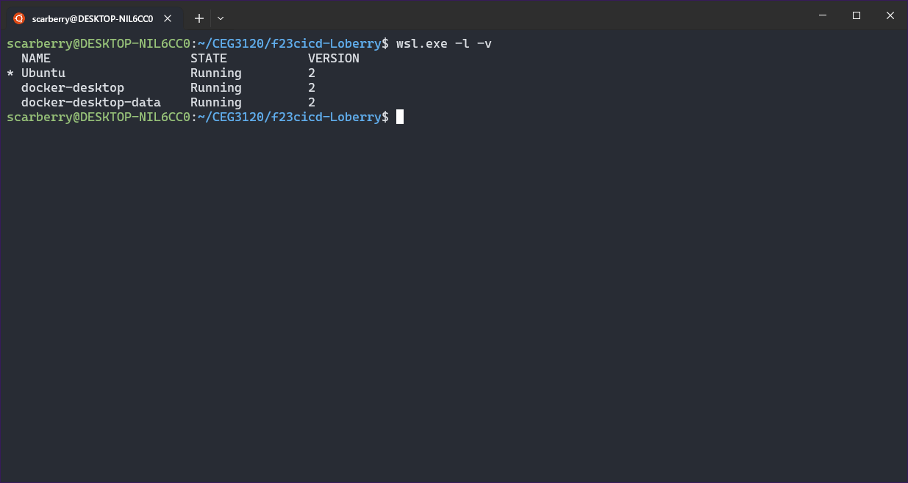
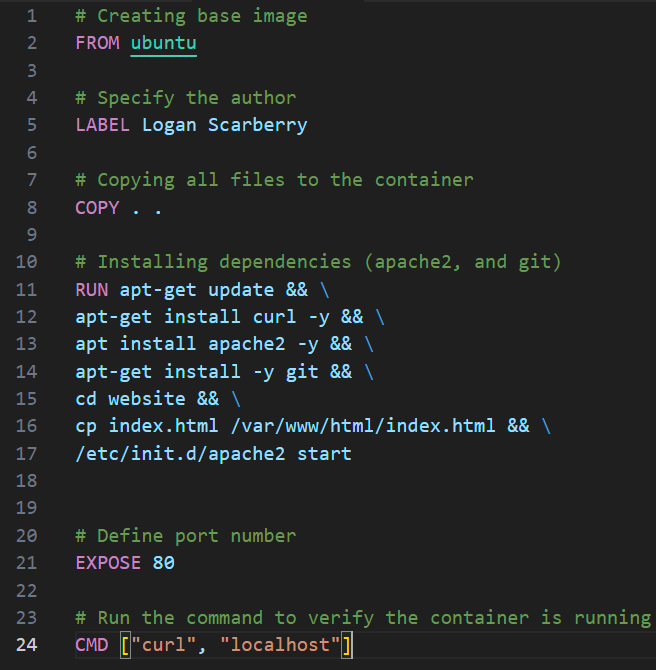
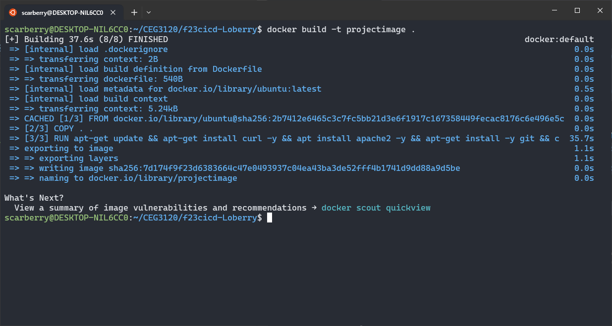
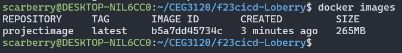
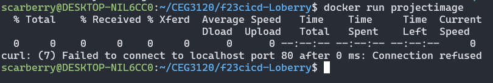
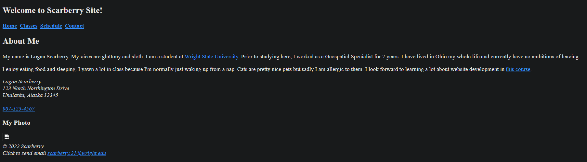

## Project 4 - CI
Name: Logan Scarberry
### Part 1 - Dockerize it
- CI Project Overview
    - In this project I am using `WSL2`, `Docker`, and `apache2`
        - `WSL2`: Using this as an engine to properly run `Docker`
        - `Docker`: Using this container as an isolated area for running processes.
        - `apache2`: Using this as a resource for setting up and hosting a web server.
        - `curl`: Using this to verify my site is properly running.
- Run Project Locally
    - how to install docker + dependencies  
        - Installation:
            1. Navigate to docker's website to find the [installer](https://docs.docker.com/desktop/wsl/#turn-on-docker-desktop-wsl-2) for `Windows`.  
            
            2. Follow the installer instructions:  
              
              
              
              
            3. Navigate to docker's `Settings` > `General` and click the checkbox for `Use the WSL 2 based engine` if it's not already checked. I didn't need to check anything here but if I did, I would need to hit `Apply & restart`.  
            
            4. Finally, to check that docker is properly running, run `wsl.exe -l -v`.  
            
    - Building an Image:
        1. Create a `Dockerfile` inside the project folder:  
        
        2. Type ` docker build -t projectimage .` inside the directory where the `Dockerfile` is located to build the docker image and tag the image with a name.  
        
        3. Use `docker images` to ensure it's running.  
        
    - Running the Container:
        1. Type `docker run projectimage` to run the container.  
        
    - Testing the Container:
        1. Type the IP into the web browser, `172.17.0.2`. This didn't work unfortunately but here's a screenshot from running on my own localhost to verify that the index.html functions correctly. Initially I had thought using `curl` would allow my to verify the site was running in the previous step but that resulted in an error.  
        
### Part 2 - GitHub Actions and DockerHub
    