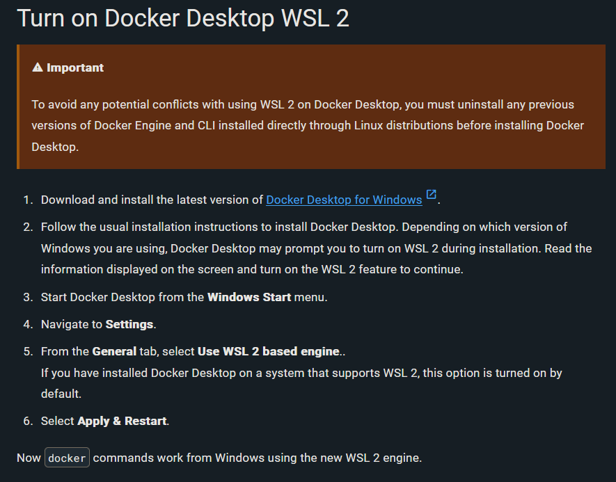
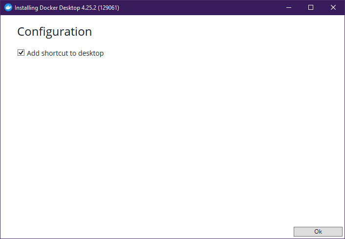
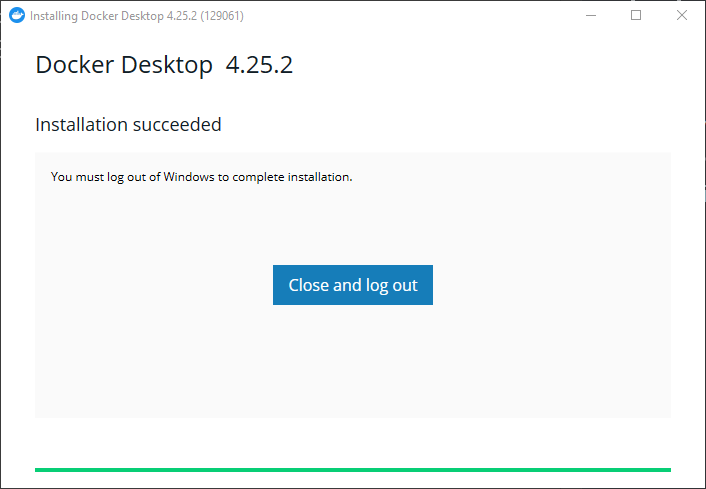
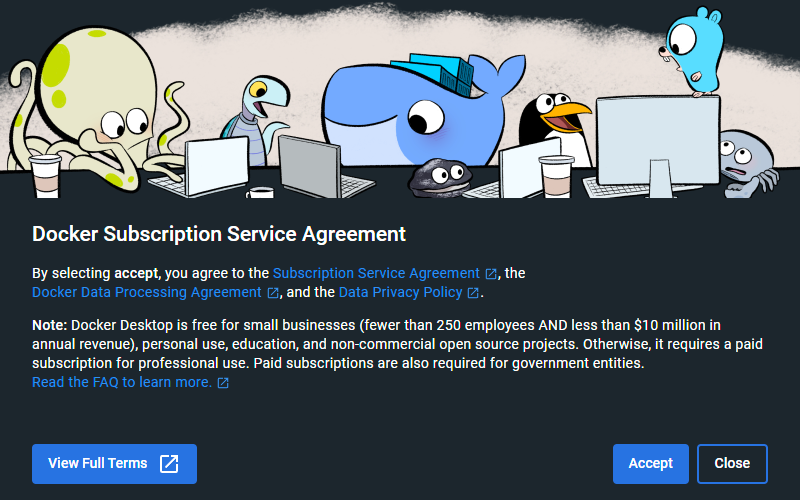
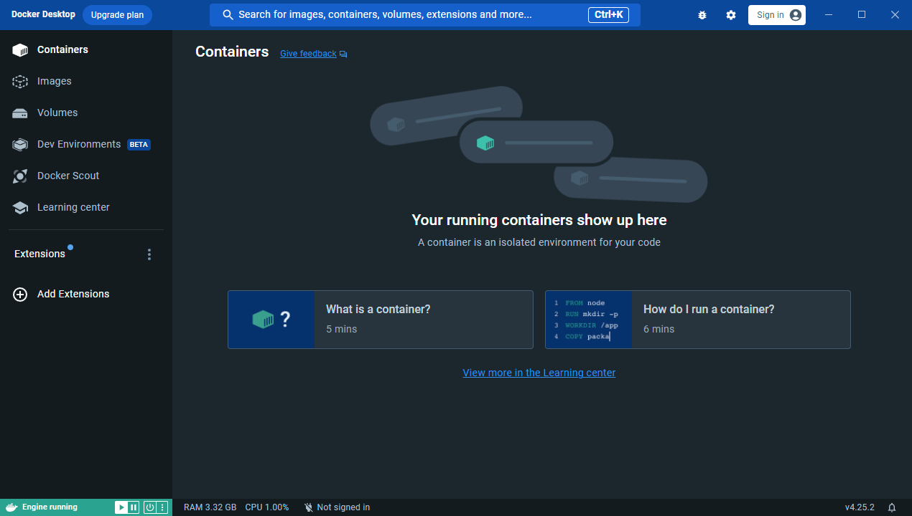
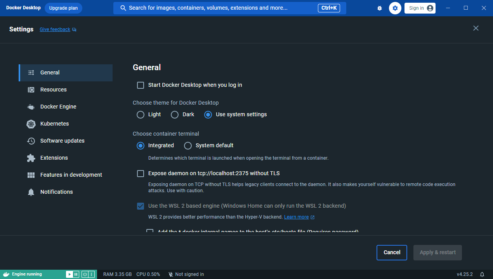

## Project 4 - CI
Name: Logan Scarberry
### Part 1 - Dockerize it
- CI Project Overview
    - In this project I am using `WSL2`, `Docker`, and `apache2`
        - `WSL2`: Using this to install `Docker`
        - `Docker`: Using this container as an isolated area for running processes.
        - `apache2`: Using this as a resource for setting up and hosting a web server.
- Run Project Locally
    - how to install docker + dependencies  
        - Installation:
            1. Navigate to docker's website to find the [installer](https://docs.docker.com/desktop/wsl/#turn-on-docker-desktop-wsl-2) for `Windows`.  
            
            2. Follow the installer instructions:  
              
              
              
              
            3. Navigate to docker's `Settings` > `General` and click the checkbox for `Use the WSL 2 based engine` if it's not already checked. I didn't need to check anything here but if I did, I would need to hit `Apply & restart`.  
            
        - Building an Image:
            1. lol
