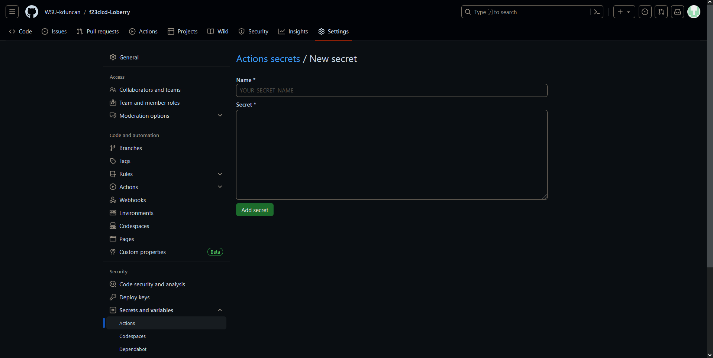

## Project 4 - CI
Name: Logan Scarberry
### Part 1 - Dockerize it
- CI Project Overview
    - In this project I am using `WSL2`, `Docker`, and `apache2`
        - `WSL2`: Using this as an engine to properly run `Docker`
        - `Docker`: Using this container as an isolated area for running processes.
        - `apache2`: Using this as a resource for setting up and hosting a web server.
        - `curl`: Using this to verify my site is properly running.
- Run Project Locally
    - how to install docker + dependencies <br>
        - Installation:
            1. Navigate to docker's website to find the [installer](https://docs.docker.com/desktop/wsl/#turn-on-docker-desktop-wsl-2) for `Windows`. <br>
            
            2. Follow the installer instructions: <br>
             <br>
             <br>
             <br>
             <br>
            3. Navigate to docker's `Settings` > `General` and click the checkbox for `Use the WSL 2 based engine` if it's not already checked. I didn't need to check anything here but if I did, I would need to hit `Apply & restart`. <br>
            
            4. Finally, to check that docker is properly running, run `wsl.exe -l -v`. <br>
            
    - Building an Image:
        1. Create a `Dockerfile` inside the project folder: <br>
        
        2. Type ` docker build -t projectimage .` inside the directory where the `Dockerfile` is located to build the docker image and tag the image with a name. <br>
        
        3. Use `docker images` to ensure it's running. <br>
        
    - Running the Container:
        1. Type `docker run projectimage` to run the container. <br>
        
    - Testing the Container:
        1. Type the IP into the web browser, `172.17.0.2`. This didn't work unfortunately but here's a screenshot from running on my own localhost to verify that the index.html functions correctly. Initially I had thought using `curl` would allow my to verify the site was running in the previous step but that resulted in an error. <br>
        
### Part 2 - GitHub Actions and DockerHub
- Creating a Public Repository in DockerHub
    1. Navigate to DockerHub, sign in and click `Repositories` at the top of the page. <br>
    
    2. Click `Create repository` and give a Repository Name and description. Then click `Create`. <br>
     <br>
    
- Authenticating with DockerHub via CLI using DockerHub Credentials
    1. From DockerHub, select your profile > `Account Settings` > `Security` > `New Access Token`. <br>
    
    2. Write an `Access Token Description` and set `Access permissions`. I recommend Read, Write, and Delete permissions simply because for this project I'm the only one using this token and the only one I need to worry about editing this repository. Click `Generate`. <br>
    
    3. Copy and save the `Access Token`. My token is `dckr_pat_QsWfX_hnTJprjmHceEq66d91Eks`. <br>
    
- Push Container Image to DockerHub
    1. Sign into DockerHub with `docker login`. <br>
    
    2. Tag the currently created image with a new name for the repo with `docker tag projectimage loberry/project4_repo`.
    3. Push the image with `docker push loberry/project4_repo`. <br>
    
- Link to DockerHub Repository:
    - `https://hub.docker.com/r/loberry/project4_repo`
- Configuring GitHub Secrets
    - How to set a secret
        1. Navigate to the repository [page](https://github.com/WSU-kduncan/f23cicd-Loberry/tree/main) and select `Settings`. <br>
        
        2. On the left under `Security`, select `Secrets and variables` > `Actions`. <br>
        
        3. Select `New repository secret`. <br>
        
        4. Enter a name and value for the secrets. I have set 2 secrets for this project named `DOCKER_USERNAME` and `DOCKER_PASSWORD`. <br>
         <br>
        
- Behavior of GitHub workflow
    - What does it do and when?
        - A GitHub workflow is a `YML` file that executes and performs tasks when a specific event is triggered. For example, you could create a workflow to trigger and perform an action everytime you run `git push`.
        - In my workflow file, it's set to push an image to DockerHub when a new release, `published` has occurred.
    - Variables to change
        - Variables that could change in this workflow file would be listed under the `env` section. `DOCKER_HUB_REPO` would be the name of the repository to push to.
```
name: Publish Docker Image
on: 
    release:
        types: [published]
    env:
        DOCKER_HUB_REPO: loberry/project4_repo
    jobs:
        push_to_registry:
            name: Push Docker image to DockerHub
            runs-on: ubuntu-latest
            steps:
                - name: Checkout the repo
                uses: actions/checkout@v2
                - name: Push to DockerHub
                uses: docker/build-push-action@v1
                with:
                    username: ${{ secrets.DOCKER_USERNAME }}
                    password: ${{ secrets.DOCKER_PASSWORD }}
                    repository: ${{ env.DOCKER_HUB_REPO }}
                    tag_with_ref: true
```
